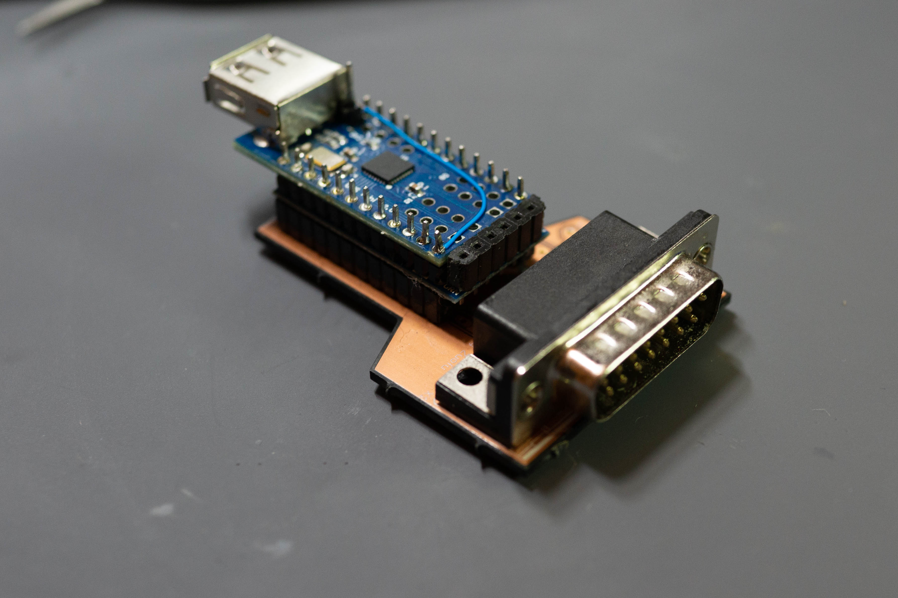

# HID2JOY
## Xbox One Controller (and other USB) to Analog IBM PC Gameport Adapter

### Intro
DOSBox has had the ability to map Xbox controllers to "Gameport" for a long time, but as far as I know, this is the first for people who want to use old hardware. I know of many converters that go the other way (use your old peripherals on a modern machine), but this allows you to use your nicer new controller with old machines. Anyway, this is WIP right now, and relies on Arduino, the USB Host Shield (MAX3421E) along with a Microchip DPot (actually, it's a rheostat). For now it only works with the Xbox One controller, since that's what the example code I started with is based off of, though it is trivial to extend to other supported controllers (Dualshock 3/4, Xbox 360..etc).

PCB is here: https://oshpark.com/projects/cPoLc5l8

### BOM:

1x Arduino Pro Mini or equivalent 3.3 V required - official or clones are fine, but make sure it's 3.3V

1x Mini USB Host Shield (based on MAX3421E) - find on eBay/Aliexpress/etc

1x MCP4452-104E digital rheostat (100K, quad channel, I2C)

2x 0603 4.7 kOhm resistor

1x 0603 .1uF ceramic capacitor

2x CES-112-01-T-S 12 position .1" pin header (low profile)

1x CES-102-02-T-S 2 position .1" pin header (low profile) or cut from larger part

1x ID15P33E4GV00LF or equivalent DB15 Male Connector right angle 2 row

Various .1" pin header strips

### Building and Modifications:

You should cut the trace on the USB Host Shield between 3.3V and VUSB, and then wire a jumper from RAW to VUSB. This will allow the controller to work with 5V (as per the USB spec) and also bypass the already overloaded regulator on the Arduino. Otherwise assemble the base PCB, then solder the Mini Host Shield with the Arduino into a stack and then solder the stack to the base PCB. Program the Arduino with the code as follows (you will need some USB serial port). If you get build errors, make sure you've installed the USB Host Shield 2.0 library using the Arduino Library manager. Make sure you connect also connected A6/A7 used for I2C (these are the two connections not in the parallel headers) between the Arduino and the PCB.

### Additional Usage Instructions (subject to change):
Holding down menu for 3 seconds switches modes. Here are the currently supported modes:

Standard 4 axis 4 button (mode 1)
Triggers and Buttons overloaded to A/B/X/Y

Thrustmaster emulation (mode 2)
Triggers are used for analog rudder X2 (Left/Right relative). Y2 is used for POV hat, multiple simultanous button presses are allowed. Note, I don't know the correct resistance values, can someone who owns Thrustmaster measure?

CH Flightstick emulation (mode 3)
Triggers are used for analog rudder X2 (Left/Right relative), left stick is used for throttle (up/down). Buttons chords are used for POV hat (digital). Multiple simultanous button pressed not allowed.

Current design remembers last mode using EEPROM and will power up with last used mode.